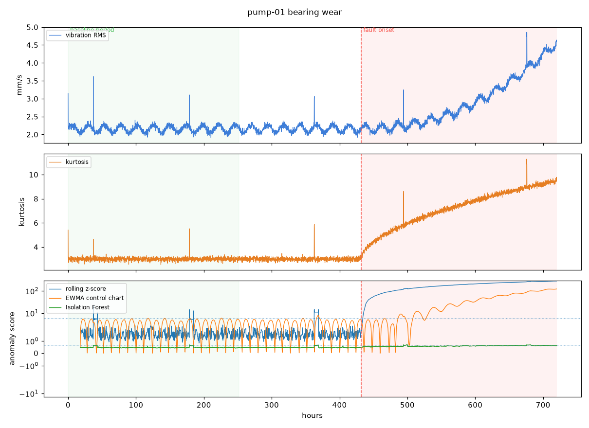

# Machine Health Monitor

Detects developing mechanical faults from sensor time series, and compares three approaches on the measure that actually matters: **how early the warning arrives.**

The headline result is that a control chart from the 1930s beats Isolation Forest by a wide margin on this problem — and the reason is understandable rather than accidental.



*Kurtosis (middle) starts climbing at fault onset while vibration RMS (top) is still flat. That gap is why both are computed.*

---

## Why lead time, and not accuracy

In a run that is healthy for two thirds of its length, a detector that never fires scores about 65% accuracy and is completely useless. Precision and recall are better, and still miss the point.

**A detector that flags a bearing three hours before seizure is technically correct and operationally worthless.** Nobody schedules a crew, orders a part, or plans downtime in three hours. One that warns four days early with a few more false alarms is the better tool, and no accuracy-style metric will ever say so.

So every detector is reported with lead time first, and false alarms per week beside it, because that trade is the actual decision a maintenance planner makes.

---

## Results

Five simulated machines, 30 days each at 10-minute sampling. Detectors are fitted on the first 35% — the commissioning period — and the alarm threshold comes from that window only, never from the run that contains the failure.

| Detector | Faults found | Mean lead time | Precision | Recall | False alarms / week | Transients flagged |
|---|---|---:|---:|---:|---:|---:|
| **EWMA control chart** | **4/4** | **+226 h** | 0.79 | 0.57 | **5.9** | **0** |
| Rolling z-score | 4/4 | −87 h | 0.76 | 0.50 | 13.3 | 22 |
| Isolation Forest | 3/4 | −90 h | 0.55 | 0.02 | 10.8 | 16 |

Positive lead time means the alarm arrived *before* the fault began. Negative means it fired that many hours *into* the failure.

**EWMA warns roughly nine days ahead.** The other two only notice once the machine is already degrading — by which point the machine has told you itself.

### Why the simplest method wins

EWMA was designed for exactly this shape of problem: a small persistent shift buried in noisy data, with one-off disturbances that must be ignored. A developing bearing fault is precisely that.

Isolation Forest is looking for points that are *unusual*, and a slow drift never produces one. Every individual sample during degradation looks reasonable; it is the trend that is wrong. That is also why its recall is 0.02 — it fires on the transients instead, which are genuinely unusual and genuinely not faults.

On the healthy control machine, Isolation Forest raised **30 false alarms per week**. A monitor like that gets muted in its first fortnight, and then it protects nothing.

---

## What is being detected

Three failure modes, each following how the real thing degrades:

| Mode | Signature |
|---|---|
| **Bearing wear** | Kurtosis climbs first, RMS follows with a knee. Early spalling is impulsive long before it raises total energy |
| **Imbalance** | RMS grows with the square of severity while kurtosis barely moves — the vibration stays sinusoidal |
| **Progressive overheating** | Temperature drifts up and current rises with it, as a tightening bearing draws more torque |

Each run also carries a handful of isolated spikes that are **not** faults — a load step, a passing forklift, a sensor glitch. A detector that flags those is producing false alarms, and a study that leaves them out flatters every method equally.

Simulation rather than a public run-to-failure dataset, because lead time cannot be measured honestly unless the fault onset is known exactly, and in real datasets that moment is usually disputed.

---

## Features

RMS, kurtosis, and crest factor are what vibration analysts have used on rotating machinery for decades. They earn their place because each fails to notice a different thing:

- **RMS** tracks total energy, and is blind to a sharp brief impact.
- **Kurtosis** tracks impulsiveness — and *falls back* toward normal late in a failure, once the damage is widespread enough to look like broad noise again. A monitor reading kurtosis alone can conclude a badly worn bearing has recovered.
- **Crest factor** shares that weakness for the same reason.

### The load problem

A machine vibrates more when it is working harder, so without correcting for load every busy shift looks like a developing fault.

The obvious correction is a ratio, `vibration / load`, and it is wrong. Vibration against load is **affine, not proportional** — there is a standing level even at low load — so dividing amplifies the swing instead of cancelling it, worst exactly when the machine is idling. Regressing the load out with a trailing least-squares fit is the correct operation, and it takes the healthy-machine variation down to the sensor noise floor.

**It is also not automatically the better input.** Feeding the load residual to the EWMA chart instead of the plain rolling mean buys 44 more hours of lead time but starts flagging transients — 8 across the fleet, against 0 before. The plain mean smooths those away; the residual, by design, does not. The default keeps the quieter option, and `EwmaControlChart(column=...)` switches it.

---

## Running it

```bash
python -m venv .venv
.venv/Scripts/activate          # Linux/macOS: source .venv/bin/activate
pip install -r requirements.txt

python scripts/run_study.py
```

Writes per-machine plots, `per_machine.csv`, and `leaderboard.csv` into `results/`.

---

## Tests

```bash
pytest -q
```

39 tests. The ones that earned their place:

- **A single sample over the threshold is not an alarm.** Six in a row is. Without that, every transient becomes a detection
- **NaN warm-up is neither a flag nor a clean bill of health.** Filling it with zero counts unscored time as confirmed-healthy; filling it forward invents an alarm on sample one
- **The threshold cannot see the failure.** Picking it from the whole run is tuning on the answer
- **Features cannot see the future.** Truncating a run must not change any feature computed before the cut
- **A ratio would not have worked** — the affine-versus-proportional point above, encoded so nobody "simplifies" it back
- **A spike decays while a shift persists.** The EWMA property that matters is duration, not peak

That warm-up test exists because the first version of this study reported eight days of lead time it had not earned. Backfilled NaNs sat above the fitted mean, the chart alarmed on sample one, and the evaluator scored the entire pre-fault period as early detection. The number looked plausible, which is what made it dangerous.

---

## Limits

**The data is simulated.** Degradation curves are modelled on how these faults behave, not measured from real machines. Ranking on real run-to-failure data would differ in magnitude — though the reason EWMA wins does not depend on the simulation.

**One fault at a time.** Real machines fail in combination, and a second fault developing during the first is not covered.

**No diagnosis, only detection.** The system says something has changed; it does not say what to replace. Distinguishing bearing wear from imbalance needs spectral analysis at a sampling rate far above the ten minutes used here.

---

Built by [Muqsit Muhammad Hanif](https://github.com/muqsithanif) · muqsithanif29@gmail.com
